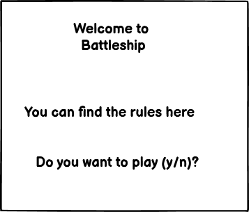
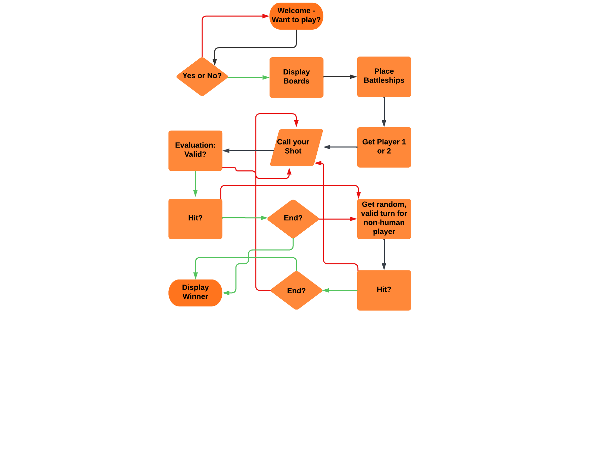

# Battleship

Being interested in different games, this Python challenge was an interesting experience. The game should be fun for all user liking those kind of games.

View the live project here: <https://project3-battleship-2a9ceefa4769.herokuapp.com/>

## Table of content

- [Battleship](#battleship)
  - [Table of content](#table-of-content)
  - [UX](#ux)
    - [Site goals](#site-goals)
    - [User stories](#user-stories)
      - [As a visitor](#as-a-visitor)
      - [As the administrator](#as-the-administrator)
    - [Wireframes](#wireframes)
    - [Flow Chart](#flow-chart)
  - [Method](#method)
    - [POC (prove of concept)](#poc-(prove-of-concept))
    - [MVP (minimum viable product)](#mvp-(minimum-viable-product))
  - [Features](#features)
    - [Index page](#index-page)
    - [Game page](#game-page)
    - [Features left to implement](#features-left-to-implement)
  - [Used Technologies](#used-technologies)
    - [Languages Used](#languages-used)
    - [Framework, Libraries and Programs](#framework-libraries-and-programs)
  - [Testing](#testing)
    - [Manual testing](#manual-testing)
    - [Testing user stories](#testing-user-stories)
    - [Validator testing](#validator-testing)
    - [Unfixed bugs](#unfixed-bugs)
  - [Deployment](#deployment)
  - [Credits](#credits)
    - [Content](#content)
    - [Media](#media)
  - [Acknowledgements](#acknowledgements)

## UX

### Site goals

The site wants to challenge the user to a fun battleship game.

### User stories

#### As a visitor

- I want to play a game of battleship
- I want to have fun
- I want to be entertained
- I want to be able to have a good overview

#### As the administrator

- I want to be able to adjust the game if needed
- I want to be able to expand the game
- I want to be able to easily add new option to the game
- I want to be able to easily add new features to the existing game

### Wireframes

Here are the drawings of the wireframes:

### Flow Chart

Here is the previously outlined flow chart which contains parts of the actual project and of version 2:

### Method

#### POC (prove of concept)

- User input → start game
- Display boards
- User guess input
- Evaluation → showing result
- Move repetition

#### MVP (minimum viable product)

- Welcome screen
- Want to play message and link to rules
- Random placement of battleships
- End of game conditions
- End screen -> announcing winner

## Features

### 

### Game page

- 

### Features left to implement

There is the possibility to integrate

- **V2 (version 2)**
  - Styling (colorama?)
  - Board size options
  - Placing Battleships
  - Number and ship sizes
  - Opponent turn
    - Random opponent guess
  - Evaluation → showing result
  - Display board with battleships

## Used Technologies

### Languages Used

- Python

### Framework, Libraries and Programs

- Frameworks 
    -
- Libraries 
    -
- Moduls
    - Random
    - Pyfiglet
- Programs
    - Balsamiq
        - was used to create the wireframes
    - Lucidchart
        - was used to create the flow chart
    - GitHub
        - was used to store the project site
    - Gitpod
        - was used to write the code and commit it to GitHub
    - Heroku 
        - was used to deploy the project 

- Am I responsive
  - was used to check the responsiveness of the website
- DevTools
  - were used to inspect the code during the development process and to check the accessibility
    - Languagetool
        - was used to check the spelling and grammar in the README file.
  
## Testing

### Manual testing

| **Feature** | **Expect** | **Action** | **Result** |
|---------------------|--------------------|--------------------------|------------------------------|

### Testing user stories

| **Expectation - User** | **Result**|
|--------------|------------|

**As the administrator**

| **Expectation - Administrator** | **Result**|
|--------------|------------|

### Validator testing

- **Python**

### Unfixed bugs

- 

## Deployment

The deployment was done using <https://www.heroku.com/>

- 
The link to the live page can be found here: [Battleship] (<https://project3-battleship-2a9ceefa4769.herokuapp.com/>)

## Credits

### Content

The content of this project was inspired by the Love Sandwiches project and the content of the course. In general, the following websites were used for inspiration:
  - <https://www.w3schools.com/>
  - <https://www.youtube.com/watch?v=RqCZBbfd9Fw>
  - <https://www.youtube.com/watch?v=tF1WRCrd_HQ>

Inspirations for specific problems were taken from the following websites:
  - <https://www.geeksforgeeks.org/python-ascii-art-using-pyfiglet-module/>
  - <https://www.freecodecamp.org/news/python-exit-how-to-use-an-exit-function-in-python-to-stop-a-program/>
  - <https://www.geeksforgeeks.org/python-docstrings/>
  - <https://www.freecodecamp.org/news/print-newline-in-python/>

### Media

- no media was used

## Acknowledgements

- I would love to thank the following persons:
  - My mentor for his support
  - The Code Institute tutor support for their fast answers
  - My facilitator for her support
  - The slack community for their fast answers and support